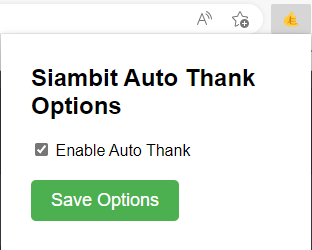

# SiamBit-Auto-Thank-Chrom-Extension
This JavaScript code is designed to work as a Google Chrome extension To auto hit button for SiamBit site

## Installation

1. Clone the repository or download the code as a ZIP file.
2. Open Google Chrome and go to the Extensions page (chrome://extensions).
3. Turn on Developer mode by clicking the toggle switch in the top right corner.
4. Click the "Load unpacked" button and select the directory where you saved the extension code.

## Usage

1. Click the extension icon in the Chrome toolbar to open the UI.
2. Set the options using the UI.
3. Click the "Save" button to save the options to the browser's storage area.

## Contributing

Contributions are welcome! To contribute, please fork the repository and create a pull request.

